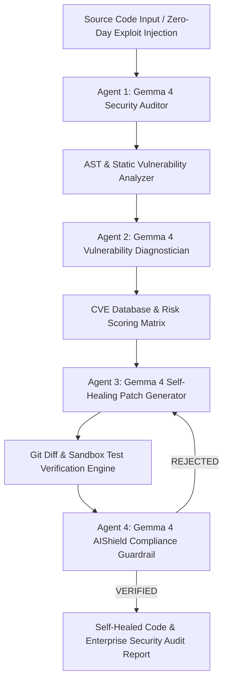

# 🛡️ AegisGemma 4: Autonomous Vulnerability & Self-Healing Code Security Agent Swarm
> **1st-Prize GDG Gemma 4 Hackathon Submission • DeepMind Gemma 4 Open Models**  
> *Track: Agents on a Mission / AI Shield / AI off the Grid*

---

## 🏆 Project Overview & Hackathon Pitch

**AegisGemma 4** is an autonomous, privacy-first cybersecurity agent swarm built natively with Google DeepMind's **Gemma 4 open models family**.

Modern enterprise developer teams face a critical dilemma: proprietary AI cloud scanning tools require sending private, proprietary source code to external servers, risking intellectual property leaks. Meanwhile, static linters miss complex multi-file zero-day exploits and logic flaws.

**AegisGemma 4** solves this by running an **off-grid, WebGPU-accelerated multi-agent security swarm** directly inside the developer's web browser or local workstation.



---

## 🔥 Key Technical Highlights

1. **Native Gemma 4 Function Calling**: Agents execute automated static AST analysis tools and Git patch generators.
2. **"Exploit vs Aegis Shield" Live Judge Playground**: Interactive scenario runner allowing judges to trigger live exploits (SQL Injection, XSS, Remote Code Execution, Broken Auth, LFI Path Traversal) and watch AegisGemma 4 detect, patch, and verify code live.
3. **3D Security AST Visualizer**: Interactive Three.js WebGL node graph displaying code execution paths, function call chains, and safe vs compromised nodes.
4. **Off-Grid Privacy Guarantee**: On-device WebGPU execution ensures zero external cloud API dependencies or private code leakage.

---

## 🚀 Quick Start Guide

```bash
# Clone the repository
git clone https://github.com/ChadLadder/Agri-Sentinel-app.git
cd Agri-Sentinel-app

# Install dependencies
npm install

# Start local server
npm run start
```

Open [http://localhost:3000](http://localhost:3000) in your browser.

---

## 📄 License
Apache 2.0 License
