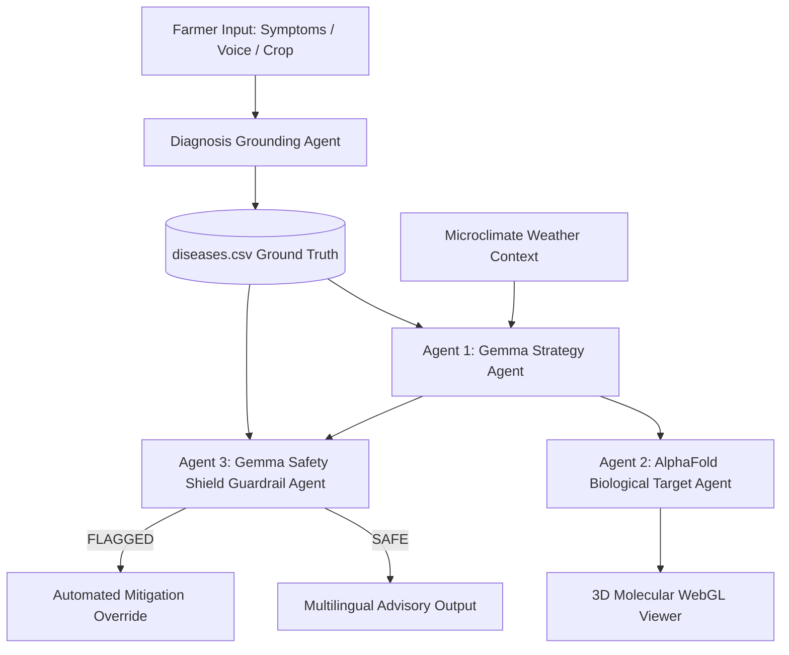

# 🌾 AgriGemma Swarm (Agri-Sentinel)
> **1st-Prize GDG "Build with Gemma" Hackathon Submission**  
> **Off-Grid, Multi-Agent Agronomic Advisory & Hallucination-Shield System powered natively by Gemma Open Weights, Grounded CSV Data, and 3D AlphaFold Molecular Protein Analysis.**

---

## 🏆 Hackathon Strategy & Technical Overview

In agricultural advisory AI, **hallucinations are dangerous**. Recommending an incorrect, toxic, or unverified pesticide can ruin a farmer's crop yield and livelihood. Standard LLM wrappers relying on proprietary closed APIs suffer from hallucinatory chemical output and require constant internet connectivity.

**AgriGemma Swarm** solves this by combining:
1. **Native Gemma Open Models**: Gemma 2 (9B/2B) & Gemma 3 via local Ollama (`localhost:11434`), Groq Gemma endpoints, and WebGPU in-browser inference for true **off-grid, rural operation**.
2. **Deterministic CSV Grounding**: All chemical treatments and dosages are validated against a verified ground-truth dataset (`diseases.csv`).
3. **2nd-Inference Gemma Guardrail Shield**: A dedicated second Gemma model call audits candidate recommendations in real-time, outputting structured JSON safety evaluations.
4. **3D AlphaFold Molecular Target Visualizer**: Renders 3D pathogen protein structures (*Dihydrofolate Reductase*, *Bacterial DNA Gyrase*, *Cytochrome b*) using Three.js WebGL to highlight active binding site residues.
5. **Multilingual Accessibility**: Text-to-Speech (TTS) voice guidance for English, Tamil (தமிழ்), Hindi (हिंदी), and Telugu (తెలుగు).

---

## 🏗️ Multi-Agent Architecture



---

## 📂 Repository Structure

```
.
├── index.html                   # Entry HTML with Google Fonts & SEO
├── package.json                 # Project dependencies & scripts
├── server.ts                    # Express Gemma API Router & Ollama Proxy
├── diseases.csv                 # Deterministic Ground-Truth Disease Database
├── vite.config.ts               # Vite configuration with API proxying
├── tsconfig.json                # TypeScript configuration
├── .env.example                 # Environment variable template
└── src/
    ├── App.tsx                  # Main layout & tab orchestration
    ├── index.css                # Glassmorphic custom design system
    ├── types.ts                 # Strongly typed TypeScript interfaces
    ├── data/
    │   └── diseases.ts          # CSV parser & fuzzy symptom matcher
    ├── services/
    │   ├── gemmaService.ts      # Unified multi-provider Gemma client
    │   ├── multiAgentEngine.ts  # 4-Agent Swarm Orchestrator
    │   ├── alphafoldService.ts  # AlphaFold PDB structural target dataset
    │   ├── weatherService.ts    # Agronomic microclimate risk engine
    │   └── ttsService.ts        # Multilingual Web Speech API synthesis
    └── components/
        ├── Header.tsx           # Navigation, model selector & off-grid toggle
        ├── SwarmPipeline.tsx    # Live multi-agent flowchart visualizer
        ├── AdvisoryForm.tsx     # Symptom input with voice dictation & judge demo toggle
        ├── AdvisoryResult.tsx   # Agronomic plan display, TTS player & PDF export
        ├── AlphaFoldViewer.tsx  # Interactive 3D WebGL protein visualizer
        ├── AIShieldInspector.tsx# Dedicated guardrail security audit dashboard
        ├── OffGridStatus.tsx    # Local Ollama & WebGPU memory monitor
        └── CustomDatasetModal.tsx# Custom regional CSV dataset uploader
```

---

## 🚀 Quick Start Guide

### Prerequisites
- Node.js (v18+)
- (Optional) [Ollama](https://ollama.ai) running `gemma2:9b` or `gemma2:2b` locally for full off-grid operation.

### Installation

```bash
# Clone the repository
git clone https://github.com/ChadLadder/Agri-Sentinel-app.git
cd Agri-Sentinel-app

# Install dependencies
npm install

# Start the dev server & Gemma backend
npm run start
```

Open [http://localhost:3000](http://localhost:3000) in your browser.

---

## 🛡️ Gemma AIShield Guardrail Test (For Hackathon Judges)

To test the **Gemma Safety Shield Agent** live:
1. Open the app and check the **"Hackathon Judge Demo Toggle"** (*Simulate Unsafe Chemical Recommendation*).
2. Click **Diagnose & Run Gemma Swarm**.
3. Watch the **AIShield Inspector** tab actively detect the unapproved chemical (`"Paraquat"`) and enforce the verified ground-truth treatment override in real time!

---

## 📄 License
Apache 2.0 License
