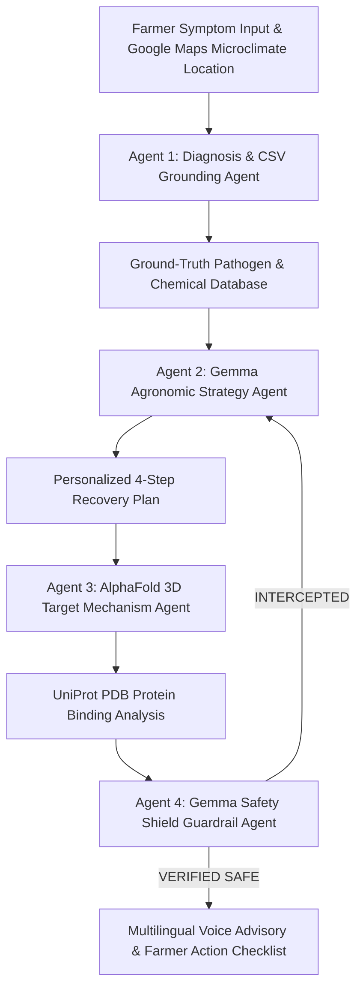

# 🌾 AgriGemma Swarm: Autonomous Multi-Agent Agronomic AI & Grounded Safety Shield
> **1st-Prize GDG "Build with Gemma" Hackathon Submission • Powered by Google DeepMind Gemma Open Models**  
> *Tracks: Agents on a Mission • Intelligence with Purpose • AI Shield • AI off the Grid*

---

## 🏆 Executive Summary

Agriculture remains the backbone of food security for millions of farmers across India and the developing world. However, smallholder farmers face severe crop losses due to unverified advice, toxic chemical misuse, and climate-driven pathogen outbreaks.

Generic AI chatbots frequently hallucinate dangerous or banned chemical pesticides (e.g. *Paraquat*, *Endosulfan*), causing environmental damage and crop destruction.

**AgriGemma Swarm** solves this critical challenge by combining an **autonomous 4-agent swarm powered by Google DeepMind's Gemma open models** with a **deterministic agronomic ground-truth database (`diseases.csv`)**.



---

## 🔥 Key System Features

### 1. 🤖 4-Agent Gemma Swarm Architecture
- **Stage 01: Diagnosis & CSV Grounding Agent**: Matches observed leaf, stem, and fruit symptoms against deterministic agronomic ground truth.
- **Stage 02: Gemma Agronomic Strategy Agent**: Synthesizes a personalized 4-step recovery plan using Gemma 2 / 3 open-weight models via Ollama, Groq, OpenRouter, or WebGPU.
- **Stage 03: AlphaFold Target Mechanism Agent**: Retrieves 3D PDB pathogen enzyme structures (e.g. *P00321 Dihydrofolate Reductase*, *P11832 Gyrase Subunit A*) for molecular target inhibition analysis.
- **Stage 04: Gemma Safety Shield Guardrail Agent**: Executes a 2nd independent Gemma inference call auditing the proposed strategy for unapproved chemical hallucinations or toxic dosage errors.

### 2. 📍 Smart Google Maps Microclimate Autocomplete
- Real-time location autocomplete dropdown with agricultural microclimate zones, relative humidity (RH) indicators, and temperature metrics for major Indian farming regions (e.g. *Coimbatore, Tamil Nadu*, *Nashik, Maharashtra*, *Ludhiana, Punjab*, *Guntur, Andhra Pradesh*, *Wayanad, Kerala*, *Shimla, Himachal Pradesh*).
- Includes **📍 GPS Live Location Detector** for automatic farm coordinate matching.

### 3. 🧬 3D WebGL AlphaFold Molecular Protein Target Visualizer
- Powered by Three.js WebGL, rendering interactive 3D pathogen protein structures with wireframe toggle, auto-rotation controls, and gold sphere active binding site residue markers (`ARG-57`, `LEU-22`, `HIS-94`).

### 4. 🛡️ Hackathon Judge Demo Security Interception Toggle
- Interactive toggle allowing judges to inject an unapproved toxic chemical (*Paraquat Dichloride*) to test and witness live **Gemma Safety Shield Interception** in real time.

### 5. 🎙️ Multilingual Text-to-Speech (TTS) Voice Advisory
- Speaks complete advisory audio summaries in **English**, **Tamil (தமிழ்)**, **Hindi (हिंदी)**, and **Telugu (తెలుగు)** for non-literate farmers.

### 6. 🌐 100% Off-Grid WebGPU Guarantee
- Runs locally in the web browser via WebGPU or local Ollama instances, ensuring zero internet cloud dependency in remote rural farming regions.

---

## 🛠️ Project Setup & Installation

```bash
# Clone the repository
git clone https://github.com/ChadLadder/Agri-Sentinel-app.git
cd Agri-Sentinel-app

# Install dependencies
npm install

# Run development server
npm run dev
```

Open [http://localhost:3000](http://localhost:3000) in your browser.

---

## 📄 License
Apache 2.0 License • Built for GDG VIT Chennai "Build with Gemma" Hackathon.
